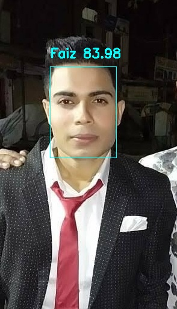
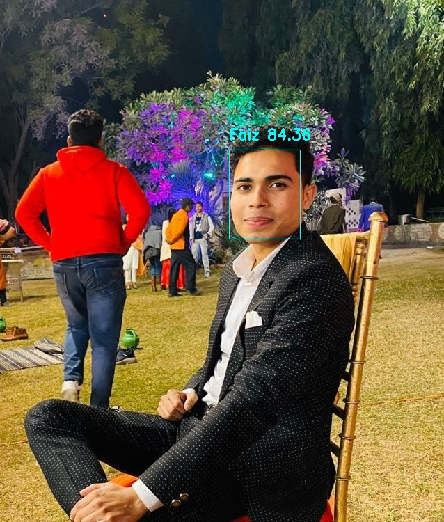
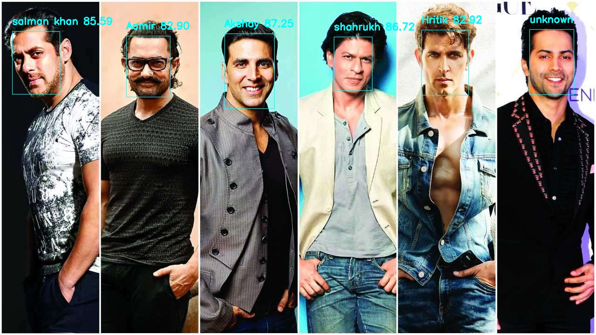
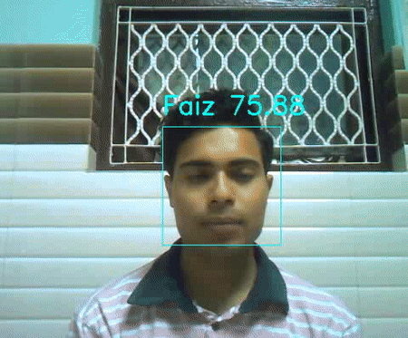

# Face Recognition
It recognizes face at real time as well as in image with very good accuracy. Now, it is built on small database, database consist of 8 people(5 bollywood actors,2 my brother and me), but it can extend easily on large no. of people. It can be used in employee attendance system, student attendance system, and in other related applications by making some modification in it.

## test model
### - image

### - real-time

It shows some lags because my laptop has low configuration.

## working
First we make dataset by collecting around 15-25 solo photos of each person in different pose,size and lighting conditon.Then,then we extract face from all these photos by using **MTCNN library**.After that,these faces convert into embeddings representation by using state of the art **Facenet-Keras model**.Finally,we run **SVM classifier** to clasify these embeddings into  different persons class.

If we want add new person in future, we can easily done by following same procedure as above for 1 person.

## Dependency
 click [here](requirements.txt) to show dependencies 
 
## License
Licensed under [MIT Licencse](LICENSE)

## Reference
* FaceNet is a face recognition system that was described by Florian Schroff, et al. at Google in their 2015 paper titled 
[“FaceNet: A Unified Embedding for Face Recognition and Clustering”](https://arxiv.org/abs/1503.03832).
* A notable example is ["Keras FaceNet by Hiroki Taniai"](https://github.com/nyoki-mtl/keras-facenet).His project provides a script for converting the Inception ResNet v1 model
from TensorFlow to Keras. He also provides a pre-trained Keras model ready for use.Download facenet-keras pre-trained model from ["here"](facenet_model/facenet_keras.h5).

